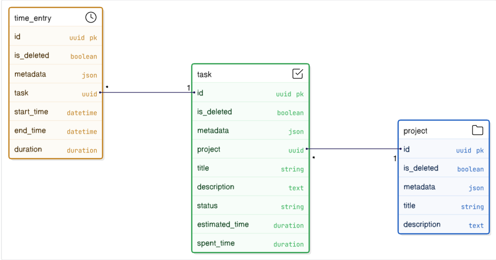

# Project Task API - Backend

A professional Django REST API for project and task management with time tracking capabilities.



## Features

- **Authentication System**: Secure login/logout with custom landing page
- **Project Management**: Create, edit, delete, and list projects with pagination and filtering
- **Task Management**: Comprehensive task management with status tracking and time estimation
- **Time Tracking**: Start/stop timers for tasks with automatic time accumulation
- **Dashboard Analytics**: Aggregate metrics and reporting with caching optimization
- **Advanced Filtering**: Search and filter across projects and tasks
- **API Documentation**: Auto-generated OpenAPI/Swagger documentation

## Tech Stack

- **Backend**: Django 5 + Django REST Framework
- **Database**: PostgreSQL (with  fallback)
- **Caching**: Redis for performance optimization
- **Containerization**: Docker & Docker Compose
- **Documentation**: drf-spectacular (OpenAPI/Swagger)
- **Testing**: pytest

## Quick Start

### Using Docker (Recommended)

1. **Clone the repository**
   ```bash
   git clone https://github.com/ndongchrist/Project-Task-APIs.git
   cd Project-Task-APIs
   ```

2. **Start the application**

   Before running the command to build images, create a `.env` file and copy the content of `.env-docker-sample.txt` into the `.env` (this will be config for docker services)

   ```bash
   docker compose up -d --build
   ```

3. **Run migrations and create sample data**
   ```bash
   docker compose exec -it web python manage.py migrate  #This commands will migrate changes into the DB
   docker compose exec -it web python manage.py create_sample_data # This commands will create sample data for test
   docker compose exec -it web python manage.py create_demo_user # email: admin123@devsecurity.com psswd: admin123
   ```

4. **Access the application**
   - Access the Application on your browser via(Login Page): http://0.0.0.0:8002/
   - Swagger Documentation: http://0.0.0.0:8002/api/docs/  # you need to be login in order to access this documention use the credentials provided by the `create_demo_user` command
   - Admin Panel: http://0.0.0.0:8002/admin/

### Local Development

1. **Setup virtual environment**
   ```bash
   python -m venv venv
   source venv/bin/activate  # On Windows: venv\Scripts\activate
   pip install -r requirements.txt
   ```

2. **Environment configuration**

   Create a file .env at the level of the project and then copy this content inside and make sure it matches your local configuration

   ```.env
   # Sample env
   DB_NAME=your-db-name
   DB_USER=postgres
   DB_PASSWORD=your-passwd
   DB_HOST=localhost
   DB_PORT=5432

   ADMIN_URL=admin/
   DEBUG=True
   SECRET_KEY=your-secret-key
   REDIS_URL=redis://localhost:6379/0
   ```

3. **Run migrations and create sample data**
   ```bash
   python manage.py migrate
   python manage.py create_sample_data --projects 10 --tasks-per-project 8
   python manage.py create_demo_user 
   ```

4. **Start development server**
   ```bash
   python manage.py runserver
   ```
   Access the application on a browser via: http://127.0.0.1:8002/

## API Endpoints

### Projects
- `GET /api/v1/projects/` - List projects with pagination and filtering
- `POST /api/v1/projects/` - Create new project
- `GET /api/v1/projects/{id}/` - Get project details
- `PUT /api/v1/projects/{id}/` - Update project
- `DELETE /api/v1/projects/{id}/` - Delete project

### Tasks
- `GET /api/v1/tasks/` - List tasks with filtering
- `POST /api/v1/tasks/` - Create new task
- `GET /api/v1/tasks/{id}/` - Get task details
- `PUT /api/v1/tasks/{id}/` - Update task
- `DELETE /api/v1/tasks/{id}/` - Delete task

### Time Tracking
- `POST /api/v1/tasks/{id}/start-timer/` - Start timer for task
- `POST /api/v1/tasks/{id}/stop-timer/` - Stop active timer

### Dashboard
- `GET /api/v1/dashboard/` - Get dashboard overview with metrics

### Tokens
- `POST /api/token/refresh/` - Refreshes the JWT access token using a valid refresh token.
- `POST /api/token/` - Obtain JWT access and refresh tokens for authentication.

### Authentication
- `POST /api/auth/logout/` - For Logging out
- `POST /api/auth/register/` - For Registering into the Application


## Architecture Highlights

### Performance Optimizations
- **Database**: Optimized queries with `select_related()` and `prefetch_related()`
- **Caching**: Redis caching for dashboard metrics and frequent queries
- **Indexing**: Strategic database indexes on frequently queried fields
- **Pagination**: Efficient pagination for large datasets

### Code Quality
- **Type Hints**: Full type annotation throughout the codebase
- **Transaction Safety**: `@transaction.atomic` for data consistency
- **Error Handling**: Comprehensive error handling with proper HTTP status codes
- **Logging**: Structured logging for debugging and monitoring

### Security
- **Validation**: Input validation at serializer and model levels
- **Constraints**: Database-level constraints for data integrity
- **UUID**: UUIDs as primary keys to prevent enumeration attacks


## Testing

Run the test suite:

```bash
# Using Docker
docker compose exec -it web bash 

#then while inside the shell found in the container enter...
pytest --cov=project

# Local development
pytest --cov=project
```

## Development Notes

### What I Enjoyed
- Implementing the time tracking system with database constraints
- Optimizing queries with Django ORM features
- Creating comprehensive API documentation + Custom Landing Page for accessing API's
- Building a robust caching strategy using Redis

### What Could Be Improved With More Time
- **WebSocket Integration**: Real-time timer updates
- **Advanced Analytics**: More detailed reporting
- **File Uploads**: Task attachments and project documents
- **Notification System**: Email/push notifications for task updates
- **Implement Celery**: Using Celery for Background Tasking for counting or sending emails
- **Email Activation For Accounts**: Sending Links to Users who register through the API asking the to Activate thier accounts.


### Satisfied Components
- **Database Design**: Well-normalized schema with proper relationships
- **API Architecture**: RESTful design with consistent patterns
- **Performance**: Efficient queries and caching implementation


### Author
- **Name**: Ndongmo Nguimfack Christian
- **Email**: christianhonore2003@gmail.com

Thank you.. Kindly Waiting for your reviews